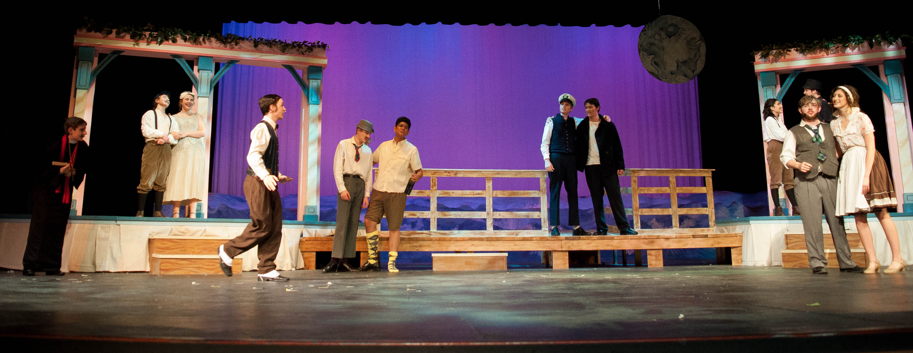

# Fall Plays

### Audition Workshops:

Come to the drama room after school on August 27th for help on your audition. Students from the advanced acting class will be non-formally coaching monologues.

### Auditions:

All auditions for 26 Pebbles, Don't Drink the Water, and the Improv team will be held on **August 30th** in the Lakewood auditorium. To get an audition time, you must sign up for a spot. There will be a signup sheet on the call board out side the drama room.

### Call Backs:

A call back list will be posted on the call board the morning following auditions. Nothing needs to be prepared for call backs. Sides \(play excerpts\) will be provided by the directors.

### What to Bring:

* Contemporary Monologue 30 seconds- 1 minute
* 5 audition sheets
* Semi formal outfit


[Click here to download a copy of the audition sheets.](https://docs.google.com/document/d/1gVw4Z-DUDPvI9RSIuyEuq4N055rgBLMSajaK8v0dDvo/edit?usp=sharing)


**Online Resources for Monologues:**





### FAQ's

**How do I audition for the fall shows?**

* Sign up for your audition time on the callboard.  Then choose a one minute monologue to perform at your audition.  Go to the the lhstheatrecompany.com website and print and fill out 6 audition forms.  Report to the theatre room 10-15 minutes before your assigned time and dress nicely for your audition.  Break a leg!

**How do I know if I get cast in a show?**

* Call backs for shows are the day following auditions.  On the third day, cast lists will be posted online and on the call board outside the theatre room.  Follow the instructions on the top of the show page on the call board to find out where and when to report if you are cast.

**If I’m not cast, how can I get involved?**

* We are always in need of crew members for the shows!  Crew lists will go up the same day as cast lists. Sign up for what crew you’re interested in and then come to the next Theatre Company meeting to see if you’re assigned to a crew.  If you’re not, please consider still getting involved in Homecoming and Trick or Treat Street.

**Do I have to do all the shows to be in the Theatre Company?**

* No!  You can join us for all of the fun stuff, but be sure your Theatre Company dues are paid.

**Do I have to be in a class to be in the plays?**

* No!  But… it does help you considerably.

