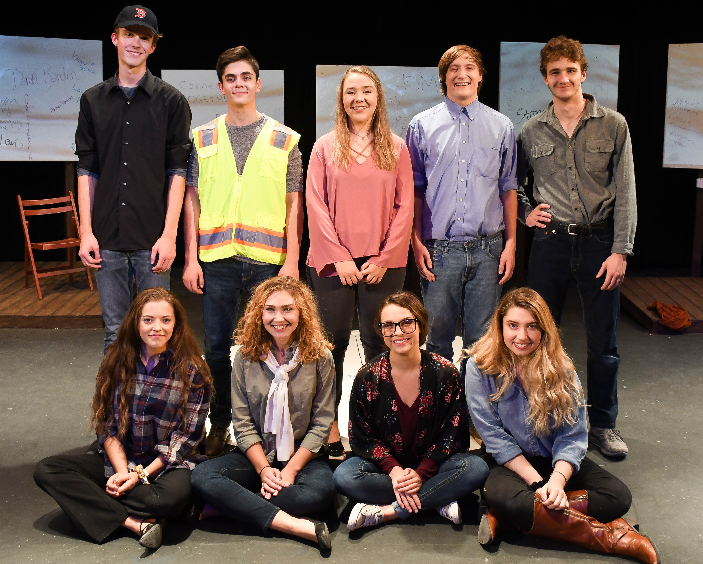

# 26 Pebbles

## Synopsis

> On December 14, 2012, Adam Lanza walked into Sandy Hook Elementary School and killed twenty-six innocent souls before taking his own life. These twenty-six innocent deaths, like pebbles thrown into a pond, created ripples and vibrations that were felt far beyond the initial rings. This is the story of those vibrations.
>
> Similar in style to _The Laramie Project_, playwright Eric Ulloa conducted interviews with members of the community in Newtown and crafted them into an exploration of gun violence and a small town shaken by a horrific event.

## Information

Thank you all for a powerful show.

### Cast List

Actor One \(Jenn/Carla\)- Elise Clayton

Actor Two \(Michael/Father Weiss\)- Ryan Shea

Actor Three \(Chris/Rabbi Shaul Praver\)- Jacob Stock

Actor Four \(Yolie/Salie\)- Grace Pouliot

Actor Five \(Georgia/Carrie\)- Nadine Rayburn

Actor Six \(Starr/Carole\)- Kelsey Kasel

Actor Seven \(Jeriann/Kat/Julie\)- Annalise Biesterfeld

Actor Eight \(Bill/Darren\)- Brendon Bishop

Actor Nine \(Mike/Joe\)- Eli Baumgarten

### Technical Team

_To be announced._

### Important Dates

Readthrough: September 1st at 10am.

Show: October 5th and 6th

### Calendar

**Add to iCal**


[Click here.](http://lhstheatrecompany.com/calendar/smykil/)


**Add to Google Calendar**


[Click here.](https://calendar.google.com/calendar/b/5?cid=MG43aGx1bWRlMzhycmc5Z25xNzJ0ZG12djhAZ3JvdXAuY2FsZW5kYXIuZ29vZ2xlLmNvbQ)


{% embed url="https://calendar.google.com/calendar/embed?src=0n7hlumde38rrg9gnq72tdmvv8%40group.calendar.google.com&ctz=America%2FDenver" %}

