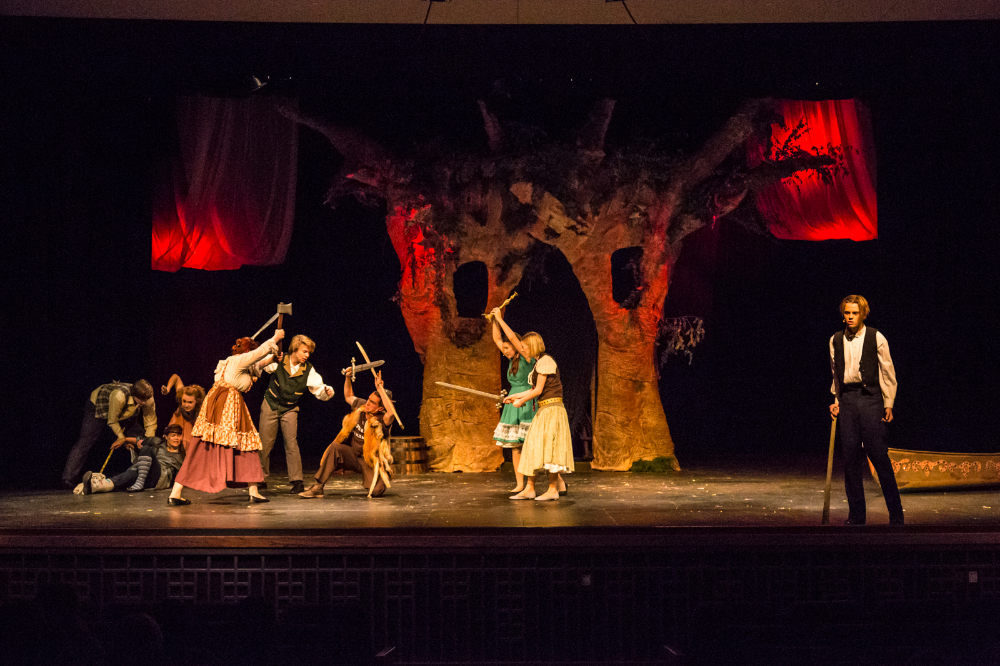

# Patrons

## Help us tell powerful stories.

### Become a patron of the LHS Theatre Company.

There are various levels to fit every situation.  See below:  

* **Friend of the Theatre:** $25 donation includes listing in all playbills for the 2018-2019 season
* **Balcony Sponsor**: $26 - $50 donation includes listing in all playbills for the 2018-2019 season and one free ticket to the fall production of your choice
* **Mezzanine Sponsor:** $51 - $75 donation includes listing in all playbills for the 2018-2019 season and one free ticket to the fall production of your choice and the spring musical
* **Orchestra Sponsor:** $76 - $100 donation includes listing in all playbills for the 2018-2019 season and two free tickets to the fall production of your choice and one ticket to the spring musical
* **Orchestra Gold:** $110 - $125 donation includes listing in all playbills for the 2018-2019 season, two free tickets to the fall production of your choice, one ticket to the spring musical, and a placard in the auditorium commemorating your support of the LHS Performing Arts program
* **Platinum:** $126 and above donation includes listing in all playbills for the 2018-2019 season, Placard in the auditorium commemorating your support of the LHS Performing Arts Program, two tickets to all LHS productions, and prime seat selection for the musical before tickets go on sale

Send an email to [**jsmykil@jeffco.k12.co.us**](mailto:jsmykil@jeffco.k12.co.us) if you'd like to start a conversation about becoming a patron. We thank you for your support of theatre arts in education.

